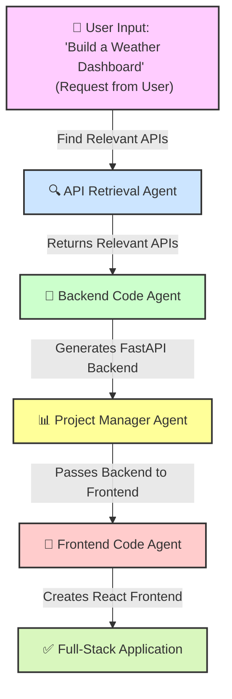

# Agentic-AI-API-Builder
An AI-powered system that **retrieves APIs**, **generates backend (FastAPI) &amp; frontend (React) code**, and **builds full-stack applications dynamically**.

## 📌[Agentic AI Workflow]



## 📌 Overview
This project creates an **Agentic AI system** that:
✅ **Finds relevant APIs** based on user input.  
✅ **Generates backend code** (FastAPI) dynamically.  
✅ **Generates frontend code** (React) dynamically.  
✅ **Uses FAISS + LLMs (Gemini AI) for API retrieval & automation.**  

---

## 📌 Technologies Used
| **Technology** | **Purpose** |
|---------------|------------|
| **FAISS** | Efficient API retrieval |
| **Sentence Transformers** | Converts API descriptions into vector embeddings |
| **FastAPI** | Backend generation |
| **React** | Frontend generation |
| **Google Gemini AI** | Code generation (backend & frontend) |
| **CrewAI** | AI agent collaboration |
| **Pyngrok** | Exposes FastAPI for testing |
| **Requests** | API calls |

---


## 📌 Setup Instructions

## 🚀 How to Run This Project in Google Colab

### **🔹 Step 1: Open the Notebook in Google Colab**
Click the link below to open the Colab notebook:

[](https://colab.research.google.com/github/Mohitnaik21/Agentic-AI-API-Builder/blob/main/Agentic_AI_Builder.ipynb)

---

### **🔹 Step 2: Install Dependencies**
Once the notebook opens in Colab, **run the first cell** to install required dependencies:
```python
!pip install crewai sentence-transformers faiss-cpu fastapi uvicorn nest-asyncio pyngrok transformers accelerate torch google-generativeai
```


### **🔹 Step 3: 🔑 Set Up Google API Key
```bash
import google.generativeai as genai

GOOGLE_API_KEY = "your-api-key-here"  # Replace with your actual API key
genai.configure(api_key=GOOGLE_API_KEY)
```


### **🔹 Step 4: Run the Project
Once dependencies are installed and the API key is set, run the notebook cells in order.

To generate a full-stack AI-powered application, run:
```python
pm_agent = ProjectManagerAgent()
backend_code, frontend_code = pm_agent.build_full_stack_app(
    "Build a weather dashboard using public APIs."
)
```

✅ The AI will generate the backend (FastAPI) & frontend (React) automatically!

### **🔹 Step 5: View & Download the Generated Code
Once the backend and frontend are generated, you can:

Copy the generated FastAPI code.

Copy the generated React frontend code.

Modify & deploy the code as needed.


📌 Features

🔹 AI-powered API retrieval using FAISS

🔹 AI-generated FastAPI backend

🔹 AI-generated React frontend

🔹 Completely autonomous full-stack generation


🎯 Future Enhancements

🚀 Deploy backend & frontend using Docker

🚀 Integrate LangChain for advanced LLM reasoning

🚀 Add more AI agents for validation & testing

📌 Modify the notebook for different project types.

📌 Deploy the generated code to a live environment (using Docker or CI/CD).

📌 Contribute by improving the AI prompts & workflow.


📝 Notes

This project runs entirely on Google Colab, no local setup is needed.

You must provide a valid Google API key for code generation.
